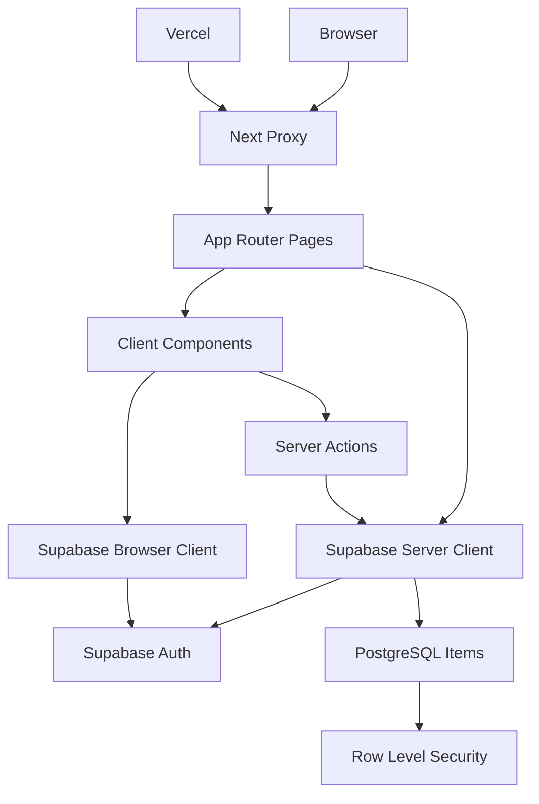
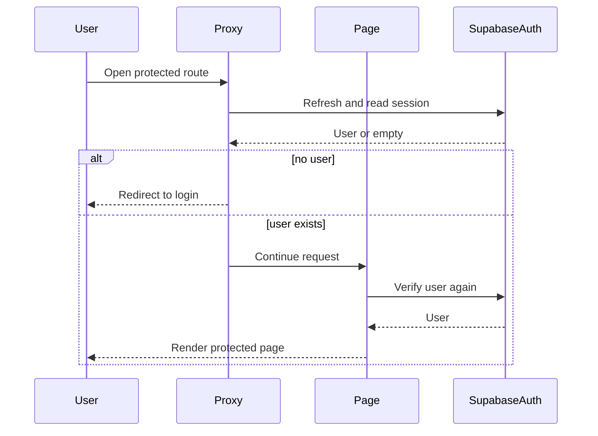
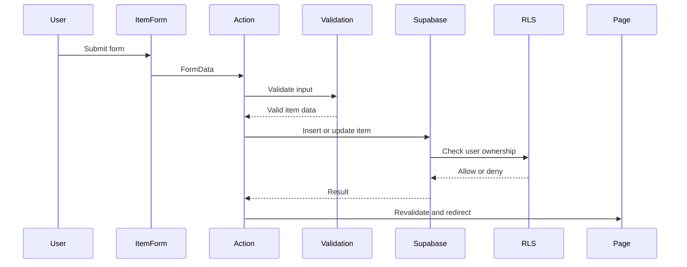
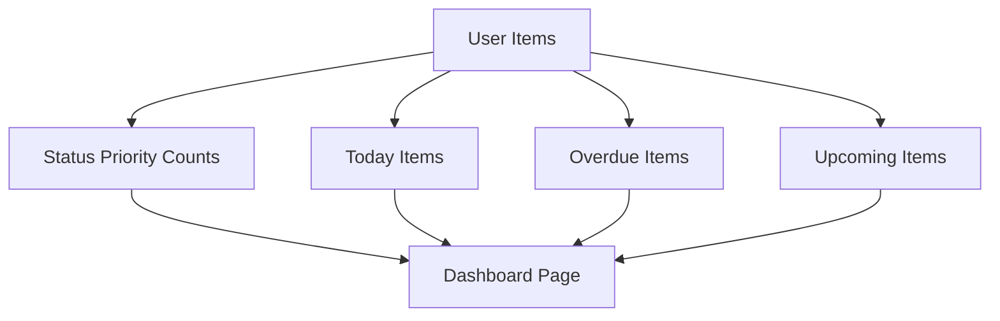
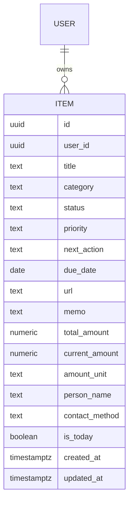
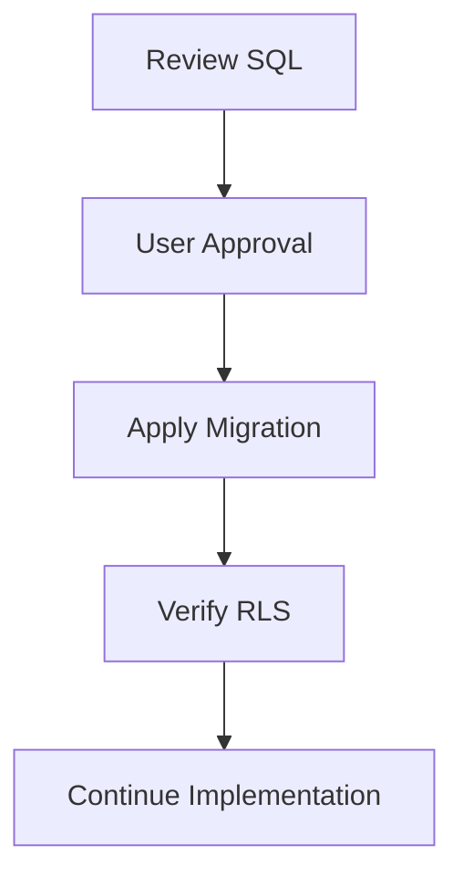

# Design Document

## Overview

「やること保管庫」は、個人ユーザーが読書・動画・勉強・人間関係・買い物などの後回し案件を共通のアイテムとして保存し、次にやること・期限・進捗・優先度を見返せるWebアプリである。本設計は、初期リリースのP0/P1機能を Next.js App Router、Supabase Auth、Supabase PostgreSQL、Supabase Row Level Security、Vercel で実現する。

ユーザーはメールアドレスとパスワードで認証し、自分の `user_id` に紐づくアイテムだけを登録・閲覧・編集・削除する。ダッシュボード、一覧、詳細、フォーム、フィルター、日付判定、進捗率計算は、初心者でも追いやすい小さなモジュールに分ける。

### Goals

- P0/P1の全機能を、共通 `items` モデルを中心に実装できる設計にする。
- 認証・`user_id`・RLS によるユーザーごとのデータ分離を設計上の必須条件にする。
- Next.js App Router と Supabase SSR の現行方針に沿い、Server Components、Client Components、Server Actions、`src/proxy.ts` の責務を明確にする。
- 複雑な抽象化を避け、初期リリースの実装タスクへ分解しやすくする。

### Non-Goals

- AI分類
- 通知
- 外部API連携
- Googleカレンダー連携
- LINE連携
- Sentry
- Linear
- 画像アップロード
- 高度なグラフ
- 共有機能、公開ページ、複数人共同編集
- スマホアプリ化

## Boundary Commitments

### This Spec Owns

- 認証画面、保護ルート、アイテム CRUD、フィルター、ダッシュボード、今日やるリスト、期限表示、空状態表示。
- `items` テーブルのデータモデル、制約、RLS policy 案。
- `Item`、`Category`、`Status`、`Priority` の型と定数。
- 期限切れ、今週中、進捗率、今日やるリスト抽出のドメインロジック。
- 初期リリースのUIコンポーネント、Server Actions、Supabase client 境界。

### Out of Boundary

- 初期リリース対象外機能の実装。
- Supabase SQL の実行。SQLとRLSは設計案として記載し、実行前に必ずユーザー承認を得る。
- 外部クライアント向け API、Webhook、ファイルアップロード、リアルタイム購読。
- 詳細なデザインシステムや高度なグラフ表現。

### Allowed Dependencies

- Next.js App Router 16.2.6
- React 19.2.4
- TypeScript 5
- Tailwind CSS 4
- Supabase Auth / PostgreSQL / Row Level Security
- `@supabase/ssr` / `@supabase/supabase-js`
- `date-fns`
- `lucide-react`
- Vercel

### Revalidation Triggers

- `items` テーブルのカラム、制約、RLS policy が変わったとき。
- `Category`、`Status`、`Priority` の値が変わったとき。
- 認証方式、session cookie、保護ルートの範囲が変わったとき。
- 日付判定、進捗率、今日やるリストのルールが変わったとき。
- 初期リリース対象外機能を追加する判断が出たとき。

## Architecture

### Existing Architecture Analysis

現状の実装は `src/app/layout.tsx`、`src/app/page.tsx`、`src/app/globals.css` のみの Next.js 初期構成に近い。既存の業務ロジック、DB接続、認証処理、共有コンポーネントはまだ存在しないため、本設計は greenfield として扱う。

### Architecture Pattern & Boundary Map

選択パターンは「App Router + Server Components + Server Actions + Supabase RLS」である。Route Handlers を増やさず、初期リリースに必要なCRUDは Server Actions で扱う。表示は Server Components を基本にし、フォームやフィルターなどのインタラクションだけ Client Components にする。Browser client は認証状態の補助に限定し、アイテムデータの取得・変更は Server Components / Server Actions から server client 経由で行う。



**Dependency direction**: `types/constants` → `validation/date logic` → `supabase clients` → `queries/actions` → `route pages` → `UI components`。上位層から下位層への逆向き import は避ける。

### Technology Stack

| Layer | Choice / Version | Role in Feature | Notes |
|-------|------------------|-----------------|-------|
| Frontend | Next.js 16.2.6 App Router, React 19.2.4 | ルーティング、Server Components、Client Components、Server Actions | `src/app` 配下に画面を配置 |
| Language | TypeScript 5 | 型安全な item / form / action 契約 | `any` は使用しない |
| Styling | Tailwind CSS 4 | レスポンシブUI | 複雑なデザインシステムは作らない |
| Auth | Supabase Auth | メール/パスワード認証 | SSR cookie は `@supabase/ssr` で扱う |
| Data | Supabase PostgreSQL | `items` 永続化 | SQL実行前にユーザー承認が必要 |
| Authorization | Supabase RLS | `user_id` による分離 | 操作別 policy |
| Date | date-fns 4.1.0 | 期限切れ、今週中判定 | ロジックを集約 |
| Icons | lucide-react 1.14.0 | 操作ボタン、状態表示 | UI補助 |
| Hosting | Vercel | デプロイ | 環境変数管理が必要 |

## File Structure Plan

### Directory Structure

```text
src/
├── app/
│   ├── layout.tsx
│   ├── page.tsx
│   ├── globals.css
│   ├── login/
│   │   └── page.tsx
│   ├── signup/
│   │   └── page.tsx
│   ├── dashboard/
│   │   ├── page.tsx
│   │   ├── loading.tsx
│   │   └── error.tsx
│   └── items/
│       ├── page.tsx
│       ├── new/
│       │   └── page.tsx
│       └── [id]/
│           ├── page.tsx
│           └── edit/
│               └── page.tsx
├── components/
│   ├── AppHeader.tsx
│   ├── AuthForm.tsx
│   ├── DashboardSummary.tsx
│   ├── TodayList.tsx
│   ├── UpcomingDeadlineList.tsx
│   ├── ItemCard.tsx
│   ├── ItemForm.tsx
│   ├── FilterBar.tsx
│   ├── EmptyState.tsx
│   ├── LoadingState.tsx
│   └── ErrorMessage.tsx
├── lib/
│   ├── auth/
│   │   └── actions.ts
│   ├── items/
│   │   ├── actions.ts
│   │   ├── constants.ts
│   │   ├── date-logic.ts
│   │   ├── queries.ts
│   │   ├── types.ts
│   │   └── validation.ts
│   └── supabase/
│       ├── client.ts
│       ├── server.ts
│       └── auth.ts
└── proxy.ts
```

### Modified Files

- `src/app/layout.tsx` — アプリ全体の言語、metadata、共通スタイルを「やること保管庫」向けにする。
- `src/app/page.tsx` — `/` として、ログイン済みなら `/dashboard`、未ログインなら `/login` へ誘導する入口にする。
- `src/app/globals.css` — Tailwind CSS 4 のグローバル設定と最低限のテーマを保つ。
- `package.json` — 既存 dependency を利用する。新規依存は初期設計では追加しない。

## System Flows

### 認証と保護ルート



`src/proxy.ts` はセッション更新と保護ルート誘導を行う。Server Components と Server Actions は、それぞれの処理時に再度ユーザーを確認する。

保護対象は `/dashboard` と `/items` 配下とする。`/`、`/login`、`/signup` は公開ルートとして扱い、Next.js の内部パス、静的アセット、画像、favicon は proxy の対象から除外する。proxy は入口の誘導だけを担当し、データ取得・更新の認可は Server Components / Server Actions と RLS で必ず再確認する。

### アイテム登録・更新



### ダッシュボード集計



## Routing Design

| Route | Access | Purpose | Main Components |
|-------|--------|---------|-----------------|
| `/` | Public | ログイン状態に応じて `/dashboard` または `/login` へ誘導 | none |
| `/login` | Public | ログイン画面 | AuthForm, ErrorMessage |
| `/signup` | Public | 新規登録画面 | AuthForm, ErrorMessage |
| `/dashboard` | Protected | サマリー、今日やるリスト、期限情報 | AppHeader, DashboardSummary, TodayList, UpcomingDeadlineList, EmptyState |
| `/items` | Protected | アイテム一覧とフィルター | AppHeader, FilterBar, ItemCard, EmptyState |
| `/items/new` | Protected | アイテム追加 | AppHeader, ItemForm, ErrorMessage |
| `/items/[id]` | Protected | アイテム詳細 | AppHeader, ItemCard detail view, ErrorMessage |
| `/items/[id]/edit` | Protected | アイテム編集 | AppHeader, ItemForm, ErrorMessage |

## Screen Design

### ログイン画面

- アプリ名、メールアドレス入力、パスワード入力、ログインボタン、新規登録へのリンクを表示する。
- ログイン失敗時は `ErrorMessage` で分かりやすい文言を表示する。
- ログイン成功後は `/dashboard` へ遷移する。

### 新規登録画面

- メールアドレス、パスワード、新規登録ボタン、ログインへのリンクを表示する。
- 登録成功後は `/dashboard` へ遷移する。

### ダッシュボード画面

- `DashboardSummary`: 総数、ステータス別件数、優先度高、期限切れ、今週中の期限件数を表示する。
- `TodayList`: `is_today = true` の未完了アイテムを表示する。
- `UpcomingDeadlineList`: 今日から7日以内の未完了アイテムを表示する。
- アイテムがない場合は初回用の `EmptyState` を表示する。
- アイテム追加ボタンは `/items/new` へリンクする。

### アイテム一覧画面

- `FilterBar` でカテゴリ、ステータス、優先度を選択する。
- `ItemCard` でタイトル、カテゴリ、ステータス、優先度、次にやること、期限、進捗率、URLボタン、詳細/編集/削除を表示する。
- 条件に一致しない場合は `EmptyState` を表示する。

### アイテム追加画面

- `ItemForm` を新規作成モードで表示する。
- 必須項目と任意項目を明確に分ける。
- カテゴリ選択に応じて補助項目を表示する。
- 保存後は `/items` へ遷移し、一覧とダッシュボード件数に反映する。

### アイテム詳細画面

- アイテムの全項目を読みやすく表示する。
- URLがある場合はリンクを表示する。
- 編集ボタンは `/items/[id]/edit` へ、戻るボタンは `/items` へ移動する。

### アイテム編集画面

- `ItemForm` を編集モードで表示し、既存値を初期値にする。
- 保存後は詳細画面または一覧画面で変更内容を確認できる。
- キャンセル時は詳細画面へ戻る。

## Requirements Traceability

| Requirement | Summary | Components | Interfaces | Flows |
|-------------|---------|------------|------------|-------|
| 1 | ユーザー認証 | AuthForm, AppHeader, Proxy, auth actions | AuthFormProps, AuthActions | 認証と保護ルート |
| 2 | アイテム登録 | ItemForm, item actions, validation | ItemFormState, ItemInput | アイテム登録・更新 |
| 3 | カテゴリ別入力補助 | ItemForm, item constants | Category, categoryFieldMap | アイテム登録・更新 |
| 4 | 一覧表示 | ItemCard, FilterBar, item queries | ItemListFilter | ダッシュボード集計 |
| 5 | 詳細表示 | ItemCard detail, item queries | Item | none |
| 6 | 編集 | ItemForm, item actions, validation | ItemInput, ActionResult | アイテム登録・更新 |
| 7 | 削除 | ItemCard, item actions | ActionResult | アイテム登録・更新 |
| 8 | フィルター | FilterBar, item queries | ItemListFilter | none |
| 9 | ダッシュボード | DashboardSummary, TodayList, UpcomingDeadlineList | DashboardData | ダッシュボード集計 |
| 10 | 進捗率 | ItemCard, ItemForm, date logic | calculateProgressPercent | none |
| 11 | 今日やるリスト | TodayList, item actions | setTodayStatus | ダッシュボード集計 |
| 12 | URLボタン | ItemCard, ItemForm, validation | validateUrl | none |
| 13 | 期限切れ | ItemCard, DashboardSummary, date logic | isOverdueItem | ダッシュボード集計 |
| 14 | 今週中期限 | UpcomingDeadlineList, date logic | isDueWithinSevenDays | ダッシュボード集計 |
| 15 | 空状態 | EmptyState | EmptyStateProps | none |
| 16 | パフォーマンス | item queries, DashboardSummary | Query limits | ダッシュボード集計 |
| 17 | セキュリティ | Supabase clients, Proxy, RLS | RLS policies | 認証と保護ルート |
| 18 | 操作性 | AppHeader, ItemForm, FilterBar | Navigation links | none |
| 19 | レスポンシブ | All UI components | Responsive classes | none |
| 20 | データ整合性 | validation, DB constraints | ItemInput validation | アイテム登録・更新 |
| 21 | エラー処理 | ErrorMessage, LoadingState, actions | ActionResult | all flows |
| 22 | 保守性 | File structure, types, constants | Module boundaries | none |
| 23 | 拡張性 | items model, constants | Stable fields | none |
| 24 | プライバシー | RLS, item queries | user_id ownership | 認証と保護ルート |
| 25 | ブラウザ対応 | App Router UI | Browser support | none |

## Components and Interfaces

### Component Summary

| Component | Domain | Intent | Req Coverage | Key Dependencies | Contracts |
|-----------|--------|--------|--------------|------------------|-----------|
| AppHeader | UI | 主要ナビゲーションとログアウト導線 | 1, 18, 19 | auth actions | UI props |
| AuthForm | UI/Auth | ログイン・新規登録フォーム | 1, 18, 21 | auth actions | UI props, ActionResult |
| DashboardSummary | UI/Dashboard | 件数サマリー表示 | 9, 13, 14, 16 | DashboardData | UI props |
| TodayList | UI/Dashboard | 今日やるリスト表示 | 9, 11, 15 | Item, item actions | UI props |
| UpcomingDeadlineList | UI/Dashboard | 今週中期限アイテム表示 | 9, 14, 15 | Item | UI props |
| ItemCard | UI/Items | 一覧・詳細用のアイテム表示 | 4, 5, 7, 10, 12, 13 | Item, item actions | UI props |
| ItemForm | UI/Items | 追加・編集フォーム | 2, 3, 6, 10, 20 | ItemInput, validation | UI props |
| FilterBar | UI/Items | 一覧絞り込み | 8, 18 | ItemListFilter | UI props |
| EmptyState | UI/Common | 空状態表示 | 4, 9, 15, 21 | none | UI props |
| LoadingState | UI/Common | 処理中表示 | 21 | none | UI props |
| ErrorMessage | UI/Common | エラー表示 | 2, 6, 7, 12, 18, 21 | ActionError | UI props |
| ItemActions | Server/Items | CRUD と今日やる更新 | 2, 6, 7, 11, 20 | Supabase server client | Server Action |
| ItemQueries | Server/Items | ユーザー所有アイテム取得 | 4, 5, 8, 9, 16, 17, 24 | Supabase server client | Service |
| ItemValidation | Domain/Items | 入力検証と変換 | 2, 6, 10, 12, 20 | constants | Service |
| ItemDateLogic | Domain/Items | 期限切れ・今週中・進捗率 | 10, 13, 14 | date-fns | Service |
| SupabaseClients | Infra | SSR/browser client 作成 | 1, 17, 24 | @supabase/ssr | Service |
| Proxy | Runtime/Auth | session refresh と保護ルート誘導 | 1, 17, 24 | Supabase server client | Runtime |

### Shared Types

```typescript
export type Category = "読書" | "動画" | "勉強" | "人間関係" | "買い物" | "その他";
export type Status = "未着手" | "途中" | "保留" | "完了" | "やめた";
export type Priority = "高" | "中" | "低";

export interface Item {
  id: string;
  user_id: string;
  title: string;
  category: Category;
  status: Status;
  priority: Priority;
  next_action: string;
  due_date: string | null;
  url: string | null;
  memo: string | null;
  total_amount: number | null;
  current_amount: number | null;
  amount_unit: string | null;
  person_name: string | null;
  contact_method: string | null;
  is_today: boolean;
  created_at: string;
  updated_at: string;
}

export type ItemCreateInput = Omit<
  Item,
  "id" | "user_id" | "created_at" | "updated_at" | "is_today"
> & {
  is_today?: boolean;
};

export type ItemUpdateInput = ItemCreateInput;
export type ItemInput = ItemCreateInput;

export interface ActionResult<T = void> {
  ok: boolean;
  data?: T;
  error?: string;
  fieldErrors?: Partial<Record<keyof ItemInput, string>>;
}
```

### Server Interfaces

```typescript
export interface ItemQueries {
  listItems(filter: ItemListFilter): Promise<Item[]>;
  getItem(id: string): Promise<Item | null>;
  getDashboardData(): Promise<DashboardData>;
}

export interface ItemActions {
  createItem(input: ItemCreateInput): Promise<ActionResult<Item>>;
  updateItem(id: string, input: ItemUpdateInput): Promise<ActionResult<Item>>;
  deleteItem(id: string): Promise<ActionResult>;
  setTodayStatus(id: string, isToday: boolean): Promise<ActionResult<Item>>;
}

export interface ItemListFilter {
  category?: Category;
  status?: Status;
  priority?: Priority;
}

export interface DashboardData {
  totalCount: number;
  statusCounts: Record<Status, number>;
  highPriorityCount: number;
  overdueCount: number;
  upcomingCount: number;
  todayItems: Item[];
  upcomingItems: Item[];
}
```

`ItemCreateInput` と `ItemUpdateInput` は、フォームと Server Actions の境界で使う正規化済み入力である。`user_id` はクライアントから受け取らず、必ず Server Action 側で認証済みユーザーから設定する。`is_today` は任意入力とし、作成時に未指定なら `false` として扱う。今日やるリストへの追加・解除は `setTodayStatus` を主経路にする。

## Data Models

### Domain Model



`Item` が集約ルートである。カテゴリ別の固有情報は初期リリースでは nullable カラムで扱う。読書・動画・勉強の進捗は `total_amount`、`current_amount`、`amount_unit` で共通化する。

### Physical Data Model

以下はSQL実行案であり、まだ実行しない。Supabaseへ適用する前に必ずユーザーへSQLを提示し、承認を待つ。

```sql
create table public.items (
  id uuid primary key default gen_random_uuid(),
  user_id uuid not null references auth.users(id) on delete cascade,
  title text not null,
  category text not null,
  status text not null,
  priority text not null,
  next_action text not null,
  due_date date null,
  url text null,
  memo text null,
  total_amount numeric null,
  current_amount numeric null,
  amount_unit text null,
  person_name text null,
  contact_method text null,
  is_today boolean not null default false,
  created_at timestamp with time zone not null default now(),
  updated_at timestamp with time zone not null default now(),
  constraint items_category_check check (category in ('読書', '動画', '勉強', '人間関係', '買い物', 'その他')),
  constraint items_status_check check (status in ('未着手', '途中', '保留', '完了', 'やめた')),
  constraint items_priority_check check (priority in ('高', '中', '低')),
  constraint items_amount_non_negative_check check (
    (total_amount is null or total_amount >= 0)
    and (current_amount is null or current_amount >= 0)
  ),
  constraint items_current_lte_total_check check (
    total_amount is null
    or current_amount is null
    or current_amount <= total_amount
  ),
  constraint items_title_not_blank_check check (char_length(btrim(title)) > 0),
  constraint items_next_action_not_blank_check check (char_length(btrim(next_action)) > 0)
);

create index items_user_id_created_at_idx on public.items (user_id, created_at desc);
create index items_user_id_status_idx on public.items (user_id, status);
create index items_user_id_due_date_idx on public.items (user_id, due_date);
create index items_user_id_is_today_idx on public.items (user_id, is_today);
```

`updated_at` は作成時に `now()` を初期値として設定する。更新時は初期リリースでは `updateItem` Server Action が現在時刻を設定する方針にし、追加のDB triggerは導入しない。将来、複数の更新経路を持つ場合は `updated_at` 自動更新 trigger の追加を検討する。

### RLS Design

以下もSQL実行案であり、実行前にユーザー承認が必要である。

```sql
alter table public.items enable row level security;

create policy "items_select_own"
on public.items
for select
to authenticated
using ((select auth.uid()) = user_id);

create policy "items_insert_own"
on public.items
for insert
to authenticated
with check ((select auth.uid()) = user_id);

create policy "items_update_own"
on public.items
for update
to authenticated
using ((select auth.uid()) = user_id)
with check ((select auth.uid()) = user_id);

create policy "items_delete_own"
on public.items
for delete
to authenticated
using ((select auth.uid()) = user_id);
```

UPDATE は SELECT policy と整合している必要がある。Server Actions 側でもユーザーIDを確認し、RLS は最終的なデータ分離として機能させる。

## Date and Progress Logic

### 期限切れ判定

```typescript
function isOverdueItem(item: Item, today: Date): boolean;
```

- `due_date` が未設定なら `false`。
- `status` が `完了` または `やめた` なら `false`。
- `due_date` が今日より前なら `true`。

### 今週中の期限判定

```typescript
function isDueWithinSevenDays(item: Item, today: Date): boolean;
```

- `due_date` が未設定なら `false`。
- `status` が `完了` または `やめた` なら `false`。
- `due_date` が今日から7日以内なら `true`。

### 今日やるリスト表示

```typescript
function isVisibleInTodayList(item: Item): boolean;
```

- `is_today` が `true` のアイテムを表示する。
- `status` が `完了` になったら今日やるリストから外す。
- `やめた` は通常表示しない。

### 進捗率計算

```typescript
function calculateProgressPercent(item: Pick<Item, "total_amount" | "current_amount">): number | null;
```

- `total_amount` または `current_amount` が未入力なら `null`。
- `total_amount` が0以下なら `null`。
- `current_amount > total_amount` は validation error。
- 表示値は0〜100%に収める。

## Input Validation

### 必須項目

- `title`
- `category`
- `status`
- `priority`
- `next_action`

`title` と `next_action` は空白のみを不可にする。

### URL形式

- URLは任意。
- 入力された場合は `http://` または `https://` のURLとして解釈できること。
- 不正な場合は保存せず、警告を表示する。

### 数値項目

- `total_amount`、`current_amount` は任意。
- 入力された場合は0以上の数値にする。
- `current_amount` は `total_amount` を超えない。

### カテゴリ・ステータス・優先度

定数から選択する。自由入力は受け付けない。

```typescript
export const CATEGORIES = ["読書", "動画", "勉強", "人間関係", "買い物", "その他"] as const;
export const STATUSES = ["未着手", "途中", "保留", "完了", "やめた"] as const;
export const PRIORITIES = ["高", "中", "低"] as const;
```

## Error Handling

### Error Strategy

- 入力エラーは `ItemForm` 上の field-level message として表示する。
- 認証エラーは `/login` への誘導または `ErrorMessage` で表示する。
- DB保存失敗は「保存に失敗しました。時間をおいて再試行してください」と表示する。
- 削除失敗は「削除に失敗しました」と表示する。
- データ取得失敗はページ内に `ErrorMessage` を表示し、画面全体を真っ白にしない。

### Loading

- `loading.tsx` と `LoadingState` でページロード中を表示する。
- Server Actions 実行中のボタンは二重送信を避ける表示にする。

## Security Considerations

- `service_role` key はフロントエンドで絶対に使わない。
- `.env.local` に環境変数を置き、GitHub に公開しない。
- `NEXT_PUBLIC_` 付きの値はブラウザに公開される前提で扱う。
- RLS は `items` テーブルで必ず有効化する。
- `src/proxy.ts` は保護ルートの入口制御を行うが、Server Components / Server Actions でも user を確認する。
- 人間関係カテゴリの `person_name`、`contact_method`、`memo` は本人以外に表示されないようRLSで分離する。

## Performance & Scalability

- 100件以下の一覧表示は3秒以内を目標にする。
- ダッシュボードは user_id で絞った items の集計を行う。
- `user_id`、`status`、`due_date`、`is_today` の index で初期リリースのフィルターと集計を支える。
- 画像・動画ファイル本体は保存しない。
- 初期リリースでは高度なキャッシュ層を作らず、Server Actions 後に該当 route を再検証する。

## Migration Strategy

SQL適用は実装フェーズではなく、ユーザー承認後に行う。適用前に以下を確認する。

1. `items` 作成SQLとRLS policy SQLを提示する。
2. ユーザー承認を得る。
3. Supabase SQL editor、CLI、または migration として適用する。
4. テストユーザーで SELECT / INSERT / UPDATE / DELETE が本人データに限定されることを確認する。



## Testing Strategy

### Unit Tests

- `calculateProgressPercent` が未入力、0、正常値、超過値を正しく扱う。
- `isOverdueItem` が期限未設定、完了、やめた、期限切れを正しく判定する。
- `isDueWithinSevenDays` が7日以内、期限なし、完了、やめたを正しく判定する。
- `validateItemInput` が必須項目、URL、数値、定数値を検証する。

### Integration Tests

- 認証済みユーザーが自分のアイテムを作成・取得・更新・削除できる。
- 未ログインユーザーが保護ルートと Server Actions を利用できない。
- RLS により別ユーザーのアイテムを取得・更新・削除できない。
- 今日やる追加と完了時のリスト除外が反映される。

### E2E/UI Tests

- 新規登録またはログイン後、ダッシュボードへ移動できる。
- アイテムを登録し、一覧・詳細・ダッシュボード件数に反映される。
- アイテムを編集し、一覧と詳細に変更が反映される。
- アイテムを削除し、一覧から消える。
- フィルター0件、初回0件、今日やる0件の空状態が表示される。

### Performance Checks

- 100件以下の一覧が3秒以内に表示される。
- ダッシュボードが3秒以内に表示される。
- フィルター操作が1秒以内に表示へ反映される。
